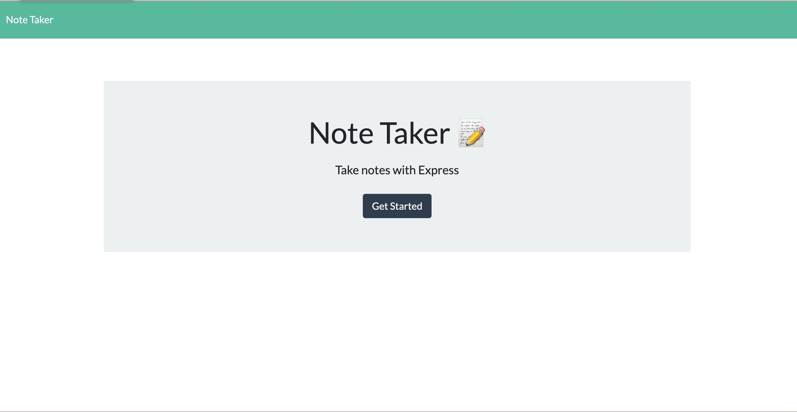
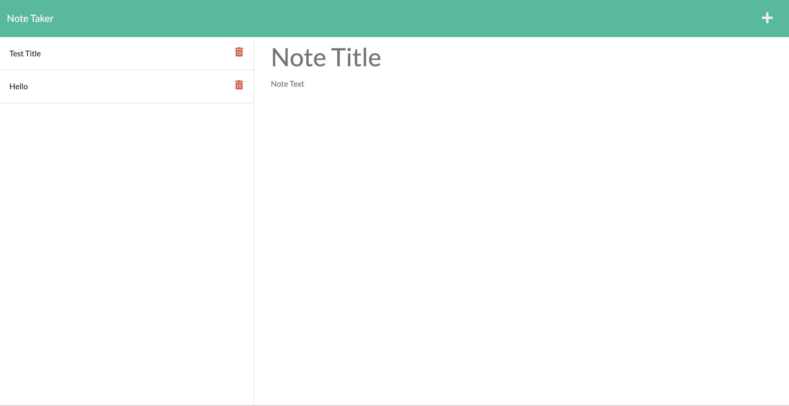
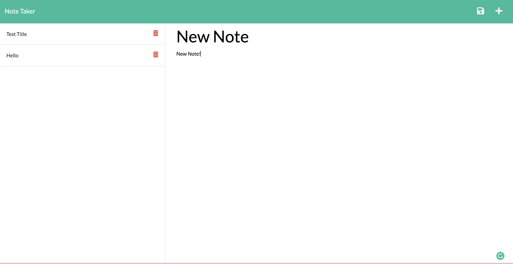

# Note Taker Application

# User Story
- AS A small business owner
- I WANT to be able to write and save notes
- SO THAT I can organize my thoughts and keep track of tasks I need to complete
# Description
The Note Taker Application is an app that allows the user to input and save notes on the go. This application is deployed using Heroku

# Table of Contents
* [Installation](#installation)
* [Usage](#usage)
* [Features](#features)
* [Links](#links)
* [Demo](#demo)
* [Questions](#questions)


# Installation
This app requires use of :
- Node.js: 
    - <b>Download:</b> https://nodejs.org/en/download/
    ```
    npm install
    ```
* Express.js:
```
npm init -y
```
```
npm i express
```
# Usage
1. Clone respository.
2. Install node.js and express.js.
3. Run in browser on PORT 3001. Example: http://localhost:3001/


# Features
* HTML
* JavaScript
* Node.js
* Express.js
* Insomonia
* Heroku

# Links
* Heroku: https://pure-stream-08939.herokuapp.com/

* GitHub Repository: https://github.com/Bbaker1989/note-taker

# Demo
Index page


Retrieve Notes


Save Notes


# Questions

Please contact me at
* Email: brittalexabaker@gmail.com
* Github: https://github.com/Bbaker1989


